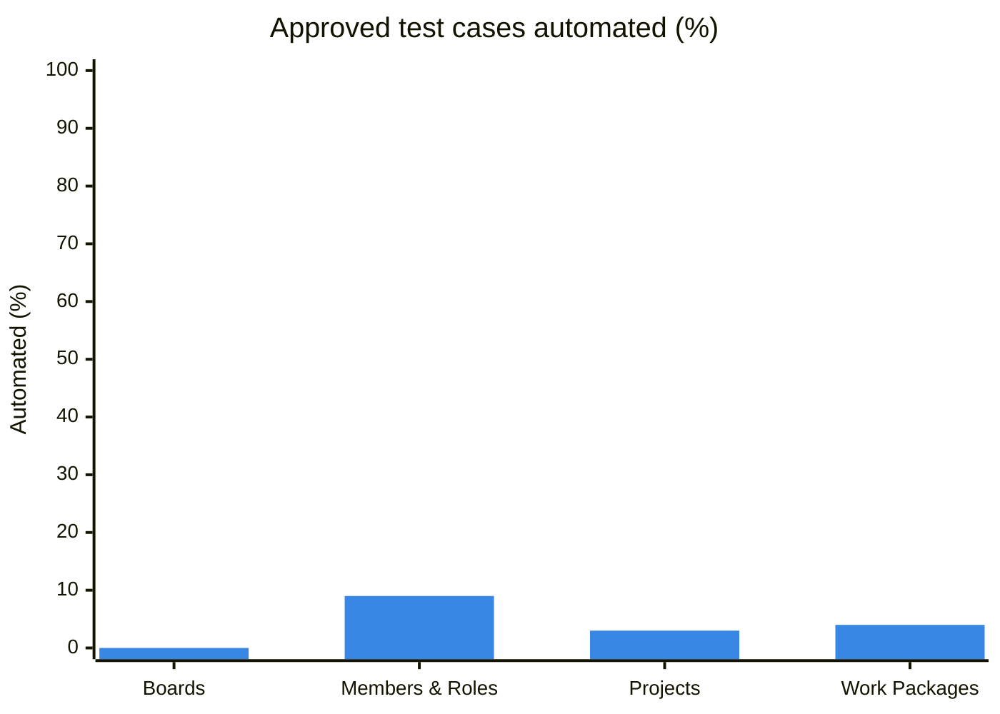
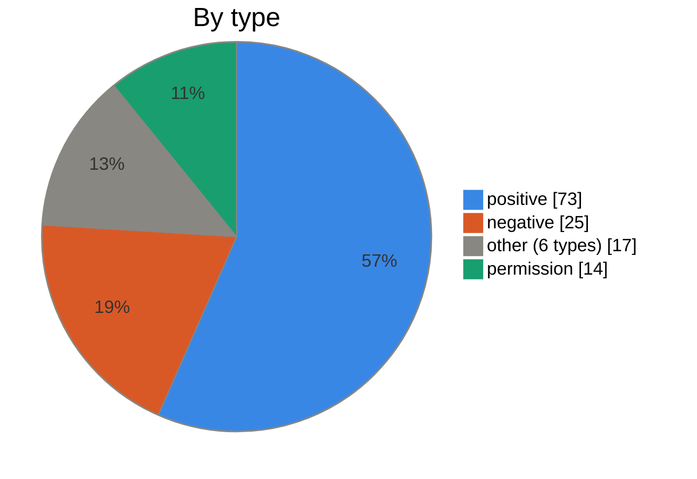
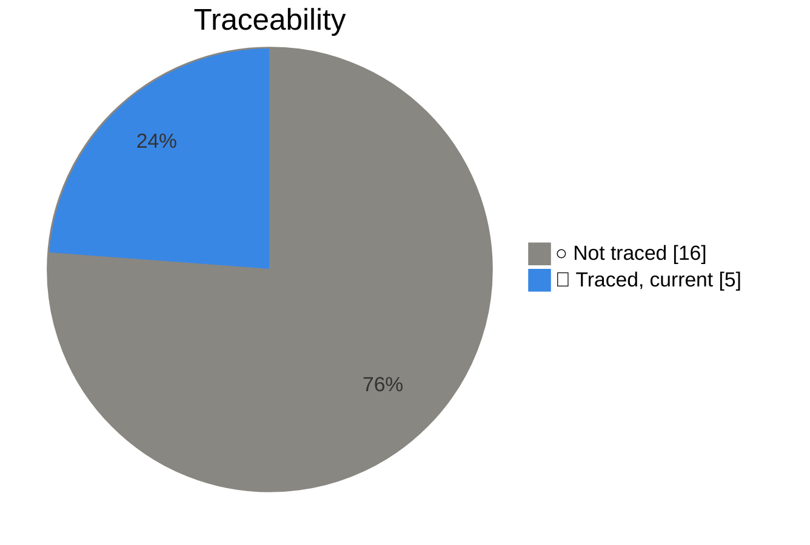
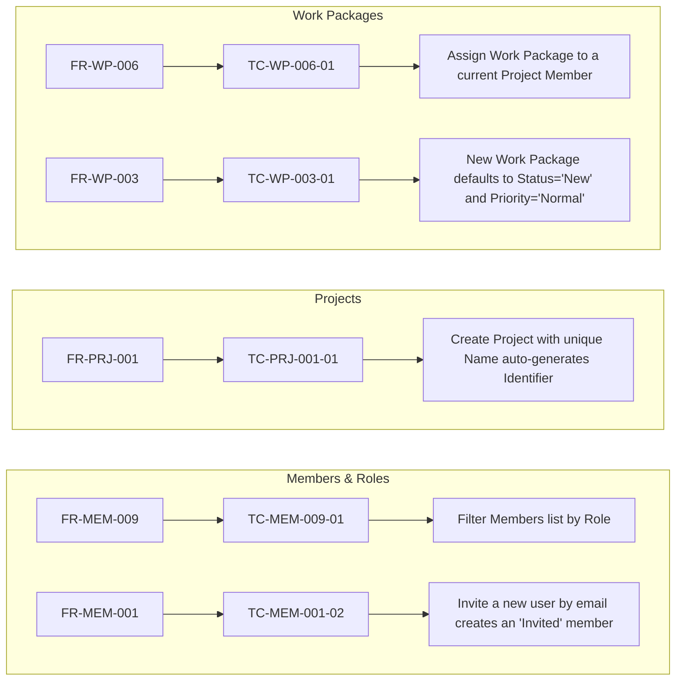

---
tags:
  - kind/dashboard
---

# Test dashboard

Generated by `npm.cmd run vault:lint -- --fix` from the vault and the tests; the lint fails while it is out of date. A test case counts as automated when a running test (not fixme or skip) covers it.

## At a glance

| Measure | Coverage | Count |
| --- | --- | --- |
| Requirements with an automated test | `█░░░░░░░░░` 12% | 5 of 42 |
| Test cases approved | `██████████` 100% | 129 of 129 |
| Approved test cases automated | `░░░░░░░░░░` 4% | 5 of 129 |
| Tests traced to a test case | `██░░░░░░░░` 24% | 5 of 21 |
| Stale tests | ✅ | 0 |
| Tests marked fixme or skip | ✅ | 0 |

## Coverage by module

| Module | Requirements | Test cases | Approved | Automated | Coverage | Tests | Stale |
| --- | --: | --: | --: | --: | --- | --: | --: |
| [[boards\|Boards]] | 8 | 28 | 28 | 0 | `░░░░░░░░░░` 0% | 0 | 0 |
| [[members-roles\|Members & Roles]] | 9 | 23 | 23 | 2 | `█░░░░░░░░░` 9% | 2 | 0 |
| [[projects\|Projects]] | 10 | 31 | 31 | 1 | `░░░░░░░░░░` 3% | 1 | 0 |
| [[work-packages\|Work Packages]] | 15 | 47 | 47 | 2 | `░░░░░░░░░░` 4% | 2 | 0 |

## Test cases

All 129 test cases are ✅ Approved.

## Automated tests

### Requirement → test case → test

Each node opens its note. A dotted edge marked "stale" is a test built from older text.

## Worklists

> [!todo]- Requirements with no automated test (37)
> - [[FR-BRD-001]]
> - [[FR-BRD-002]]
> - [[FR-BRD-003]]
> - [[FR-BRD-004]]
> - [[FR-BRD-005]]
> - [[FR-BRD-006]]
> - [[FR-BRD-007]]
> - [[FR-BRD-008]]
> - [[FR-MEM-002]]
> - [[FR-MEM-003]]
> - [[FR-MEM-004]]
> - [[FR-MEM-005]]
> - [[FR-MEM-006]]
> - [[FR-MEM-007]]
> - [[FR-MEM-008]]
> - [[FR-PRJ-002]]
> - [[FR-PRJ-003]]
> - [[FR-PRJ-004]]
> - [[FR-PRJ-005]]
> - [[FR-PRJ-006]]
> - [[FR-PRJ-007]]
> - [[FR-PRJ-008]]
> - [[FR-PRJ-009]]
> - [[FR-PRJ-010]]
> - [[FR-WP-001]]
> - [[FR-WP-002]]
> - [[FR-WP-004]]
> - [[FR-WP-005]]
> - [[FR-WP-007]]
> - [[FR-WP-008]]
> - [[FR-WP-009]]
> - [[FR-WP-010]]
> - [[FR-WP-011]]
> - [[FR-WP-012]]
> - [[FR-WP-013]]
> - [[FR-WP-014]]
> - [[FR-WP-015]]

> [!note]- Tests that cover no test case (16)
> - [[Create basic board with a list]]
> - [[Create and delete a board]]
> - [[Delete all boards]]
> - [[Create a one-time meeting and verify it appears on the meetings list]]
> - [[Add an agenda item to a meeting]]
> - [[Delete a meeting from the meeting show page]]
> - [[Invite a new member via email and verify they appear in the members list]]
> - [[Invite a member with -Reader- role and verify the assigned role]]
> - [[Change a member role from Member to Project admin]]
> - [[Remove a member from the project]]
> - [[Filter members by name and verify filtered results]]
> - [[Sidebar navigation shows invited members]]
> - [[Work Packages CRUD › Create work package (task)]]
> - [[Work Packages CRUD › Delete work package (task)]]
> - [[Work Packages CRUD › Create work package (phase)]]
> - [[Work Packages CRUD › Delete work package (phase)]]
