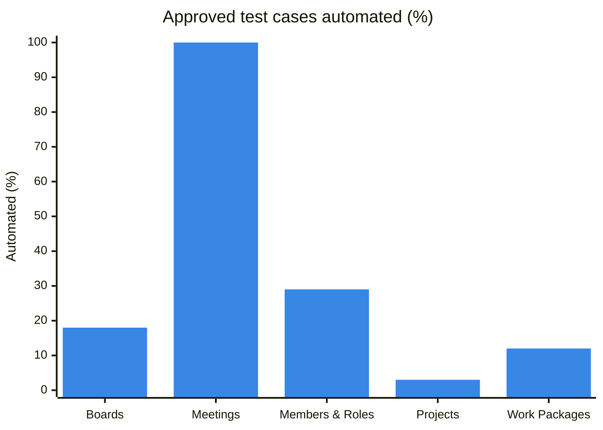
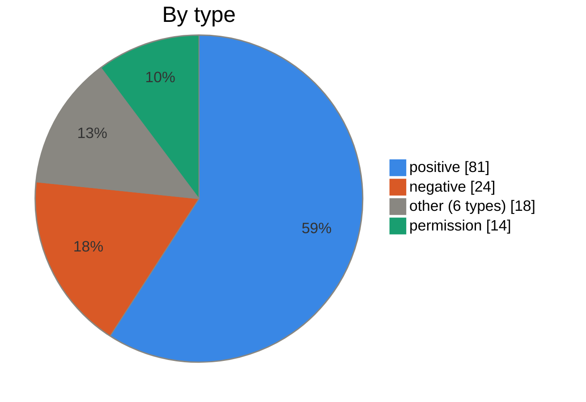
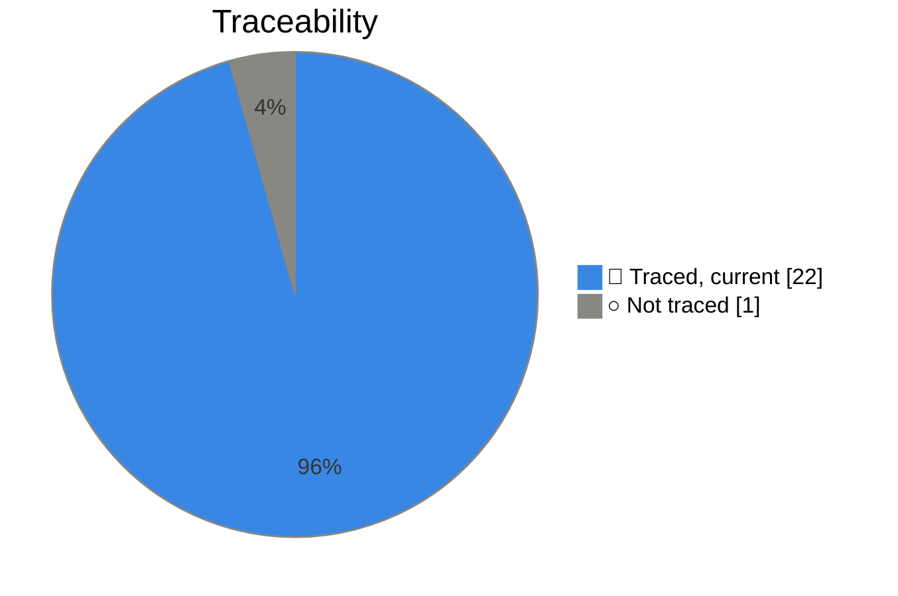

---
tags:
  - kind/dashboard
---

# Test dashboard

Generated by `npm.cmd run vault:lint -- --fix` from the vault and the tests; the lint fails while it is out of date. A test case counts as automated when a running test (not fixme or skip) covers it.

## At a glance

| Measure | Coverage | Count |
| --- | --- | --- |
| Requirements with an automated test | `████░░░░░░` 37% | 17 of 46 |
| Test cases approved | `██████████` 100% | 137 of 137 |
| Approved test cases automated | `██░░░░░░░░` 16% | 22 of 137 |
| Tests traced to a test case | `██████████` 96% | 22 of 23 |
| Stale tests | ✅ | 0 |
| Tests marked fixme or skip | ✅ | 0 |

## Coverage by module

| Module | Requirements | Test cases | Approved | Automated | Coverage | Tests | Stale |
| --- | --: | --: | --: | --: | --- | --: | --: |
| [[boards\|Boards]] | 8 | 28 | 28 | 5 | `██░░░░░░░░` 18% | 4 | 0 |
| [[meetings\|Meetings]] | 3 | 3 | 3 | 3 | `██████████` 100% | 3 | 0 |
| [[members-roles\|Members & Roles]] | 9 | 24 | 24 | 7 | `███░░░░░░░` 29% | 8 | 0 |
| [[projects\|Projects]] | 10 | 31 | 31 | 1 | `░░░░░░░░░░` 3% | 1 | 0 |
| [[work-packages\|Work Packages]] | 16 | 51 | 51 | 6 | `█░░░░░░░░░` 12% | 6 | 0 |

## Test cases

All 137 test cases are ✅ Approved.

## Automated tests

### Requirement → test case → test

Each node opens its note. A dotted edge marked "stale" is a test built from older text.

```mermaid
flowchart LR
    subgraph M_boards["Boards"]
        direction LR
        R_FR_BRD_001["FR-BRD-001"] --> C_TC_BRD_001_01["TC-BRD-001-01"] --> T_Create_basic_board_with_a_list["Create basic board with a list"]
        R_FR_BRD_003["FR-BRD-003"] --> C_TC_BRD_003_01["TC-BRD-003-01"] --> T_Create_basic_board_with_a_list["Create basic board with a list"]
        R_FR_BRD_003["FR-BRD-003"] --> C_TC_BRD_003_02["TC-BRD-003-02"] --> T_Rename_an_existing_list["Rename an existing list"]
        R_FR_BRD_001["FR-BRD-001"] --> C_TC_BRD_001_03["TC-BRD-001-03"] --> T_A_board_title_that_duplicates_another_in_a_different_case_is_accepted["A board title that duplicates another in a different case is accepted"]
        R_FR_BRD_007["FR-BRD-007"] --> C_TC_BRD_007_01["TC-BRD-007-01"] --> T_Create_and_delete_a_board["Create and delete a board"]
    end
    subgraph M_meetings["Meetings"]
        direction LR
        R_FR_MTG_001["FR-MTG-001"] --> C_TC_MTG_001_01["TC-MTG-001-01"] --> T_Create_a_one_time_meeting_and_verify_it_appears_on_the_meetings_list["Create a one-time meeting and verify it appears on the meetings list"]
        R_FR_MTG_002["FR-MTG-002"] --> C_TC_MTG_002_01["TC-MTG-002-01"] --> T_Add_an_agenda_item_to_a_meeting["Add an agenda item to a meeting"]
        R_FR_MTG_003["FR-MTG-003"] --> C_TC_MTG_003_01["TC-MTG-003-01"] --> T_Delete_a_meeting_from_the_meeting_show_page["Delete a meeting from the meeting show page"]
    end
    subgraph M_members_roles["Members & Roles"]
        direction LR
        R_FR_MEM_009["FR-MEM-009"] --> C_TC_MEM_009_01["TC-MEM-009-01"] --> T_Filter_Members_list_by_Role["Filter Members list by Role"]
        R_FR_MEM_001["FR-MEM-001"] --> C_TC_MEM_001_02["TC-MEM-001-02"] --> T_Invite_a_new_user_by_email_creates_an__Invited__member["Invite a new user by email creates an 'Invited' member"]
        R_FR_MEM_001["FR-MEM-001"] --> C_TC_MEM_001_02["TC-MEM-001-02"] --> T_Invite_a_new_member_via_email_and_verify_they_appear_in_the_members_list["Invite a new member via email and verify they appear in the members list"]
        R_FR_MEM_002["FR-MEM-002"] --> C_TC_MEM_002_03["TC-MEM-002-03"] --> T_Invite_a_member_with__Reader__role_and_verify_the_assigned_role["Invite a member with -Reader- role and verify the assigned role"]
        R_FR_MEM_004["FR-MEM-004"] --> C_TC_MEM_004_01["TC-MEM-004-01"] --> T_Change_a_member_role_from_Member_to_Project_admin["Change a member role from Member to Project admin"]
        R_FR_MEM_005["FR-MEM-005"] --> C_TC_MEM_005_01["TC-MEM-005-01"] --> T_Remove_a_member_from_the_project["Remove a member from the project"]
        R_FR_MEM_003["FR-MEM-003"] --> C_TC_MEM_003_03["TC-MEM-003-03"] --> T_Filter_members_by_name_and_verify_filtered_results["Filter members by name and verify filtered results"]
        R_FR_MEM_009["FR-MEM-009"] --> C_TC_MEM_009_02["TC-MEM-009-02"] --> T_Sidebar_navigation_shows_invited_members["Sidebar navigation shows invited members"]
    end
    subgraph M_projects["Projects"]
        direction LR
        R_FR_PRJ_001["FR-PRJ-001"] --> C_TC_PRJ_001_01["TC-PRJ-001-01"] --> T_Create_Project_with_unique_Name_auto_generates_Identifier["Create Project with unique Name auto-generates Identifier"]
    end
    subgraph M_work_packages["Work Packages"]
        direction LR
        R_FR_WP_006["FR-WP-006"] --> C_TC_WP_006_01["TC-WP-006-01"] --> T_Assign_Work_Package_to_a_current_Project_Member["Assign Work Package to a current Project Member"]
        R_FR_WP_003["FR-WP-003"] --> C_TC_WP_003_01["TC-WP-003-01"] --> T_New_Work_Package_defaults_to_Status__New__and_Priority__Normal_["New Work Package defaults to Status='New' and Priority='Normal'"]
        R_FR_WP_001["FR-WP-001"] --> C_TC_WP_001_04["TC-WP-001-04"] --> T_Work_Packages_CRUD___Create_work_package__task_["Work Packages CRUD › Create work package (task)"]
        R_FR_WP_016["FR-WP-016"] --> C_TC_WP_016_01["TC-WP-016-01"] --> T_Work_Packages_CRUD___Delete_work_package__task_["Work Packages CRUD › Delete work package (task)"]
        R_FR_WP_001["FR-WP-001"] --> C_TC_WP_001_05["TC-WP-001-05"] --> T_Work_Packages_CRUD___Create_work_package__phase_["Work Packages CRUD › Create work package (phase)"]
        R_FR_WP_016["FR-WP-016"] --> C_TC_WP_016_02["TC-WP-016-02"] --> T_Work_Packages_CRUD___Delete_work_package__phase_["Work Packages CRUD › Delete work package (phase)"]
    end
    class R_FR_BRD_001,C_TC_BRD_001_01,T_Create_basic_board_with_a_list,R_FR_BRD_003,C_TC_BRD_003_01,C_TC_BRD_003_02,T_Rename_an_existing_list,C_TC_BRD_001_03,T_A_board_title_that_duplicates_another_in_a_different_case_is_accepted,R_FR_BRD_007,C_TC_BRD_007_01,T_Create_and_delete_a_board,R_FR_MTG_001,C_TC_MTG_001_01,T_Create_a_one_time_meeting_and_verify_it_appears_on_the_meetings_list,R_FR_MTG_002,C_TC_MTG_002_01,T_Add_an_agenda_item_to_a_meeting,R_FR_MTG_003,C_TC_MTG_003_01,T_Delete_a_meeting_from_the_meeting_show_page,R_FR_MEM_009,C_TC_MEM_009_01,T_Filter_Members_list_by_Role,R_FR_MEM_001,C_TC_MEM_001_02,T_Invite_a_new_user_by_email_creates_an__Invited__member,T_Invite_a_new_member_via_email_and_verify_they_appear_in_the_members_list,R_FR_MEM_002,C_TC_MEM_002_03,T_Invite_a_member_with__Reader__role_and_verify_the_assigned_role,R_FR_MEM_004,C_TC_MEM_004_01,T_Change_a_member_role_from_Member_to_Project_admin,R_FR_MEM_005,C_TC_MEM_005_01,T_Remove_a_member_from_the_project,R_FR_MEM_003,C_TC_MEM_003_03,T_Filter_members_by_name_and_verify_filtered_results,C_TC_MEM_009_02,T_Sidebar_navigation_shows_invited_members,R_FR_PRJ_001,C_TC_PRJ_001_01,T_Create_Project_with_unique_Name_auto_generates_Identifier,R_FR_WP_006,C_TC_WP_006_01,T_Assign_Work_Package_to_a_current_Project_Member,R_FR_WP_003,C_TC_WP_003_01,T_New_Work_Package_defaults_to_Status__New__and_Priority__Normal_,R_FR_WP_001,C_TC_WP_001_04,T_Work_Packages_CRUD___Create_work_package__task_,R_FR_WP_016,C_TC_WP_016_01,T_Work_Packages_CRUD___Delete_work_package__task_,C_TC_WP_001_05,T_Work_Packages_CRUD___Create_work_package__phase_,C_TC_WP_016_02,T_Work_Packages_CRUD___Delete_work_package__phase_ internal-link;
```

## Worklists

> [!todo]- Requirements with no automated test (29)
> - [[FR-BRD-002]]
> - [[FR-BRD-004]]
> - [[FR-BRD-005]]
> - [[FR-BRD-006]]
> - [[FR-BRD-008]]
> - [[FR-MEM-006]]
> - [[FR-MEM-007]]
> - [[FR-MEM-008]]
> - [[FR-PRJ-002]]
> - [[FR-PRJ-003]]
> - [[FR-PRJ-004]]
> - [[FR-PRJ-005]]
> - [[FR-PRJ-006]]
> - [[FR-PRJ-007]]
> - [[FR-PRJ-008]]
> - [[FR-PRJ-009]]
> - [[FR-PRJ-010]]
> - [[FR-WP-002]]
> - [[FR-WP-004]]
> - [[FR-WP-005]]
> - [[FR-WP-007]]
> - [[FR-WP-008]]
> - [[FR-WP-009]]
> - [[FR-WP-010]]
> - [[FR-WP-011]]
> - [[FR-WP-012]]
> - [[FR-WP-013]]
> - [[FR-WP-014]]
> - [[FR-WP-015]]

> [!note]- Tests that cover no test case (1)
> - [[Delete all boards]]
