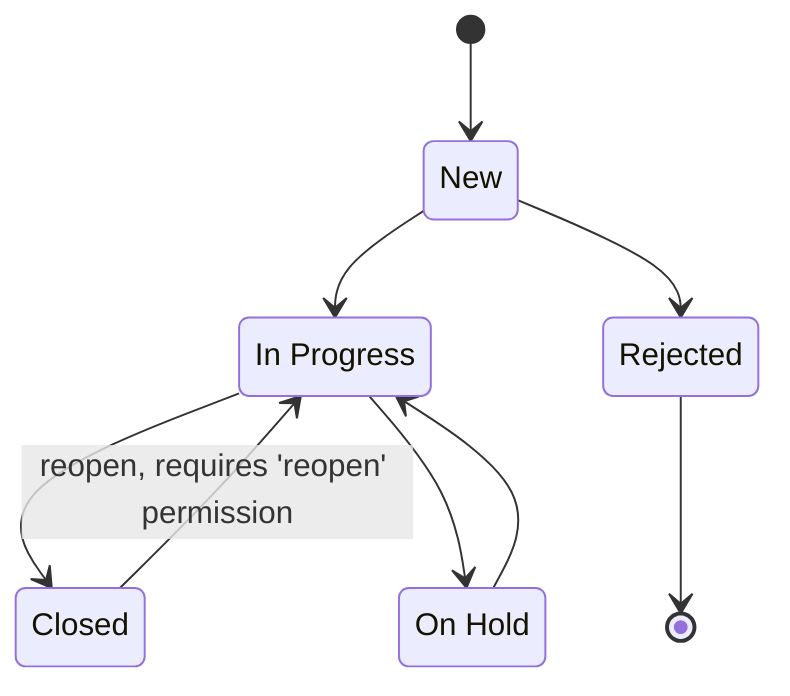

Representative default [[Workflow|workflow]] for the 'Task' type (may vary by configuration):

```mermaid
stateDiagram-v2
    state "In Progress" as InProgress
    state "On Hold" as OnHold
    [*] --> New
    New --> InProgress
    InProgress --> Closed
    New --> Rejected
    InProgress --> OnHold
    OnHold --> InProgress
    Closed --> InProgress: reopen, requires 'reopen' permission
    Rejected --> [*]
```

## Referenced by

![[Referenced by.base]]
